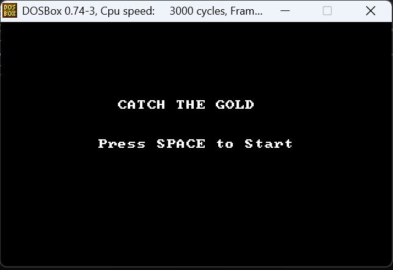
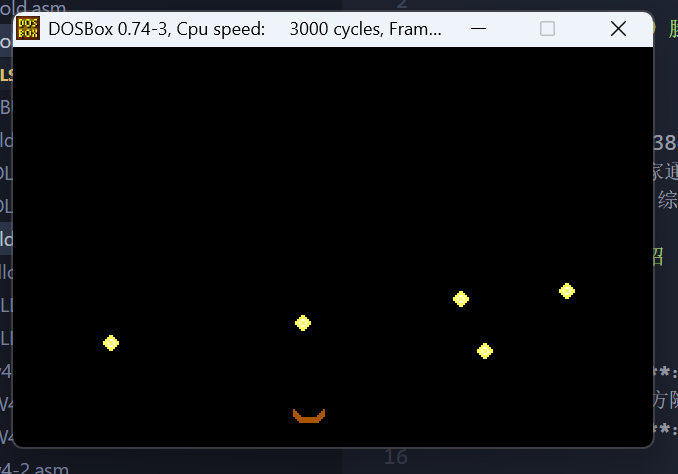
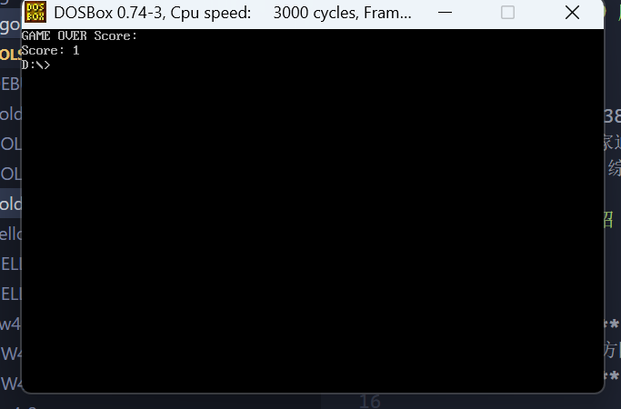

# 汇编语言课程结课作业报告：接金币游戏 (Catch the Gold)

# author: 2351459 滕其峰 2025/12/7

## 一、 项目概述

本项目是一个基于 80386 架构、使用 MASM（Microsoft Macro Assembler）汇编语言开发的动作类小游戏——**Catch the Gold**（接金币）。游戏设定在一个 320×200 分辨率的 VGA 图形环境下，玩家通过控制位于屏幕底部的“聚宝盆”左右移动，接住从屏幕上方随机掉落的金币。游戏包含了重力下落逻辑、物体碰撞检测、计分系统以及生命值管理机制，旨在通过一个完整的游戏开发流程，综合运用汇编语言中的中断调用、显存操作、端口读写及算法逻辑。

## 二、 项目功能介绍

### 1. 游戏元素

- **玩家（聚宝盆）**：由玩家控制的角色，图形为一个棕色的凹槽，仅能在屏幕底部进行水平方向的移动。
- **金币**：屏幕上方随机位置生成的掉落物，图形为黄色像素块，具有垂直向下的速度向量。
- **计分板与生命值**：屏幕左上角实时显示玩家当前的生命值（以红色方块表示），游戏结束后显示最终得分。

### 2. 游戏规则

- 玩家需要接住掉落的金币，每接住一个金币，得分增加。
- 如果金币掉落至屏幕最下方且未被接住，则视为“漏接”，扣除一点生命值。
- 初始生命值为 3 点，当生命值归零或玩家主动按下 ESC 键时，游戏结束。

### 3. 操作方式

- **左箭头键**：控制聚宝盆向左移动。
- **右箭头键**：控制聚宝盆向右移动。
- **空格键**：在欢迎界面开始游戏。
- **ESC 键**：退出游戏。

### 4. 项目展示

#### 项目启动



#### 接金币



#### 结算得分



## 三、 汇编语言技术实现详解

本项目涵盖了汇编语言程序设计的多个核心知识点。以下将结合源代码对关键技术进行解析。

### 1. 内存分段与处理器指令集

程序使用了 `.386` 伪指令，开启了 80386 处理器指令集支持，这允许程序在实模式下使用 32 位寄存器（如 `EAX`、`ECX`、`EDI`）进行高效的数据传输。程序采用了标准的段式结构，定义了数据段 `data segment` 和代码段 `code segment`。

**代码示例：**

```assembly
.386                ; 启用386指令集
.model small
data segment use16  ; 定义16位数据段
    score dw 0
    ; ...
data ends
```

### 2. BIOS 与 DOS 中断调用

程序大量使用了软件中断来实现硬件控制和系统服务。

- **INT 10h（BIOS 视频服务）**：用于切换显示模式和光标控制。程序通过功能号 `0013h` 进入 VGA 图形模式（320×200，256 色）。
- **INT 21h（DOS 系统调用）**：用于获取系统时间种子、显示字符串以及程序退出。
- **INT 16h（BIOS 键盘服务）**：用于非阻塞地检测键盘输入，保证游戏循环的流畅性。

**代码示例：**

```assembly
mov ax, 0013h       ; AH=00h (设置模式), AL=13h (VGA 320x200)
int 10h             ; 调用BIOS视频中断

mov ah, 01h         ; 功能号01h：检查键盘缓冲区状态
int 16h             ; 调用BIOS键盘中断
jz logic_update     ; 若标志位ZF=1，表示无按键，跳转至逻辑更新
```

### 3. 直接显存访问与字符串操作指令

为了提高图形渲染效率，程序没有使用慢速的 BIOS 画点功能，而是直接向显存段地址 `0A000h` 写入数据。结合 `REP STOSD` 和 `LODSB` 等字符串操作指令，实现了极高效率的清屏和精灵图（Sprite）绘制。

**代码示例：**

```assembly
; 高效清屏逻辑
mov ax, 0A000h
mov es, ax          ; ES指向VGA显存段
xor di, di          ; DI指向偏移地址0
xor eax, eax        ; 颜色为0（黑色）
mov cx, 16000       ; 循环次数：320*200 / 4字节
rep stosd           ; 使用32位指令一次填充4个像素
```

### 4. 端口 I/O 与硬件同步

为了防止画面撕裂并控制游戏运行速度，程序直接读取 VGA 状态寄存器端口 `03DAh`，检测垂直同步信号（VSync）。这是底层硬件交互的典型应用。

**代码示例：**

```assembly
mov dx, 3DAh        ; VGA输入状态寄存器1的端口地址
vsync_wait1:
    in al, dx       ; 从端口读取状态
    test al, 8      ; 测试第3位（垂直回扫位）
    jz vsync_wait1  ; 等待显示周期结束
```

### 5. 结构体数组与间接寻址

游戏中的金币数据通过一个结构体数组进行管理，每个金币占用 8 个字节（包含状态、X 坐标、Y 坐标、速度）。程序利用寄存器间接寻址方式，通过 `BX` 寄存器作为基址指针来访问数组中的不同字段。

**代码示例：**

```assembly
lea bx, coins           ; BX指向金币数组首地址
; ...
mov ax, [bx+4]          ; 访问偏移量为4的字段（Y坐标）
add ax, 2               ; 更新Y坐标
mov [bx+4], ax          ; 写回内存
```

### 6. 过程调用与堆栈操作

程序将功能模块封装为子程序（Procedure），如 `rand`（随机数生成）、`draw_sprite_block`（绘图）。在子程序调用中，严格遵守了保护现场的原则，使用 `PUSH` 和 `POP` 指令保存和恢复通用寄存器的值。

**代码示例：**

```assembly
draw_sprite_block proc near
    push ax             ; 保存寄存器环境
    push bx
    push di
    push si
    ; ... 绘图逻辑 ...
    pop si              ; 恢复寄存器环境
    pop di
    pop bx
    pop ax
    ret
draw_sprite_block endp
```

### 7. 逻辑运算与碰撞检测算法

游戏的核心逻辑依赖于算术运算和比较指令。碰撞检测采用轴对齐包围盒（AABB）算法，通过比较金币与玩家坐标的相对位置来判断是否接触。此外，随机数生成使用了线性同余法，涉及乘法 `MUL` 和除法 `DIV` 指令。

**代码示例：**

```assembly
; 伪随机数生成算法
mov ax, rand_seed
mov dx, 351
mul dx                  ; AX = AX * 351
add ax, 45              ; AX = AX + 45
mov rand_seed, ax       ; 保存新种子

; 碰撞检测逻辑
cmp ax, player_y        ; 比较金币Y坐标与玩家Y坐标
jl check_ground         ; 若小于，说明未接触，跳转检测是否落地
```

## 四、 项目心得与挑战

### 1. 汇编语言的精确控制

在开发过程中，最深刻的体会是汇编语言对硬件的绝对控制权。例如在处理键盘输入时，必须区分普通按键和扩展按键。方向键属于扩展键，按下时会产生两个字节的扫描码，第一次读取为 `00h` 或 `E0h`，第二次才是实际的键码。为了实现流畅的移动，代码中分别处理了 `INT 16h` 的状态查询和读取功能，这不仅要求对中断机制有深入理解，还要求对标志寄存器的状态变化了如指掌。

### 2. 内存布局与数据结构设计

与高级语言不同，汇编语言没有内置的类或结构体关键字。在设计金币数组时，我需要手动计算每个元素的字节偏移量。例如代码中的 `add bx, 8` 指令，这里的 `8` 代表一个金币结构体占用了 4 个字（Word）。这种手动的内存管理虽然繁琐，但极大地加深了我对计算机内存线性寻址方式的理解。

### 3. 图形渲染中的透明色处理

在绘制非矩形物体（如金币和聚宝盆）时，如果直接覆盖显存，物体的背景色会遮挡游戏背景。为了解决这个问题，我在 `draw_sprite_block` 子程序中实现了“透明色剔除”逻辑。通过 `lodsb` 读取模型数据后，立即使用 `cmp al, 0` 指令检查像素值，如果是 0 则跳过写入显存的步骤。这一简单的逻辑判断实现了复杂的图形叠加效果。

### 4. 调试与优化的过程

初期开发时，金币生成的概率设置过低，导致游戏开局长时间空白。经过调试，我调整了随机数判断的阈值，从 `cmp al, 10` 修改为 `cmp al, 60`，显著改善了游戏体验。此外，为了防止屏幕闪烁，我深入研究了 VGA 的垂直同步机制，通过轮询 `03DAh` 端口实现了帧同步，这展示了汇编语言在处理时序敏感任务时的优势。

## 五、 总结

通过本次《接金币》游戏的开发，我不仅巩固了 80x86 指令集的使用，更从底层视角理解了计算机图形显示、中断处理、内存管理以及程序流程控制的运作机理。汇编语言虽然代码量大且开发周期长，但其在理解计算机体系结构和优化程序性能方面具有不可替代的教育价值。这段从零构建游戏逻辑的经历，极大地提升了我的逻辑思维能力和底层编程素养。
